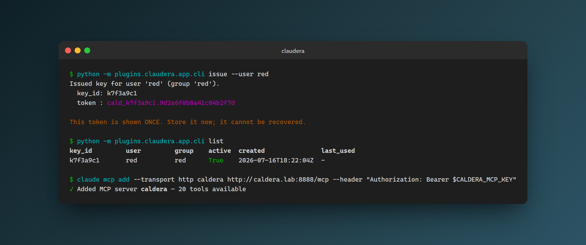

<div align="center">


-orange)


# claudera

**Drive MITRE Caldera from Claude, over your LAN, with no model API key inside Caldera.**

</div>

`claudera` turns [MITRE Caldera](https://github.com/mitre/caldera) v5 into an authenticated remote [Model Context Protocol](https://modelcontextprotocol.io) server. An external Claude client (Claude Code or Claude Desktop) connects across the LAN, Caldera exposes the tools, and Claude is the client. The intelligence lives in your Claude subscription, so no model API key is ever stored in Caldera.

This is the inverse of Caldera's bundled `mcp` plugin, which embeds an LLM inside Caldera. `claudera` is a fresh build; only small, clearly marked pieces are vendored from Caldera under Apache-2.0 (see [`NOTICE.md`](NOTICE.md)).

> **Beta, lab-only.** Built and verified against a live Caldera 5.3.0 lab. Do not expose the MCP endpoint to untrusted networks.

<div align="center">



</div>

## Features

- **Runs inside Caldera.** The MCP server mounts as a route on Caldera's own aiohttp app: no second web server, no extra port, and only the MCP Python SDK on top of Caldera's runtime.
- **Authenticated by default.** Every request carries `Authorization: Bearer <key>`. A bad or missing key is rejected with HTTP 401 before any session starts.
- **Per-user keys, scoped to real groups.** Keys map to a Caldera username and group taken from Caldera's own config, so a key can only act as a real user. Tokens are stored hashed (argon2); the raw token is shown once.
- **20 structured tools.** Create abilities, adversaries and operations, drive the full operation lifecycle, read results back, and emit SIEM correlation keys. Every tool returns JSON, never free prose.
- **Deterministic, ATT&CK-aligned naming.** Artefacts get names like `T1059.001_desc` and persist to disk exactly like ones made in the Caldera UI.
- **Safe payload handling.** Downloads are limited to a trusted allow-list (Atomic Red Team and the MITRE stockpile by default), verified by sha256, never executed, and never placed on an agent.
- **GUI panel and run history.** A magma Vue panel shows runs, events and downloads, and manages keys. Every mutating call is attributed to a user and logged.

## Tools

| Group | Tools |
|-------|-------|
| Connectivity | `server_info`, `ping` |
| Read agents | `list_agents` |
| Creation | `create_ability`, `create_adversary`, `create_operation` |
| Execution control | `start_operation`, `pause_operation`, `resume_operation`, `stop_operation`, `get_operation_status` |
| Read-back | `get_operation_report`, `query_facts`, `list_abilities`, `list_adversaries`, `list_operations` |
| Correlation | `get_correlation_keys` |
| Payloads | `find_payload`, `download_payload` |
| Run history | `get_run_history` |

## Quick start

Run all three from the Caldera root, with Caldera's virtualenv active.

1. Clone into Caldera's plugins directory. The directory must be named `claudera` — `hook.py` imports `plugins.claudera.*`:
   ```bash
   git clone https://github.com/sect0r-cybersec/claudera.git plugins/claudera
   ```
2. Install the dependency. The MCP Python SDK is the only one; aiohttp and starlette already come with Caldera:
   ```bash
   pip install -r plugins/claudera/requirements.txt
   ```
3. Add `claudera` to the `plugins:` list in `conf/default.yml`, then start Caldera. `--build` compiles the magma GUI so the **claudera** panel appears in the nav (needed once, and after any change to `gui/`):
   ```bash
   python server.py --build --insecure
   ```

`--insecure` runs Caldera with its default configuration and default credentials, which suits the lab-only scope of this plugin. Drop the flag once you have a `conf/local.yml`.

## Usage

Issue a per-user key from the Caldera root (the group is resolved from Caldera's config), then point a Claude client at the endpoint.

```bash
# Issue a key for a user
python -m plugins.claudera.app.cli issue --user red

# List, rotate, revoke, or re-activate
python -m plugins.claudera.app.cli list
python -m plugins.claudera.app.cli rotate   --key-id <id>
python -m plugins.claudera.app.cli revoke   --key-id <id>
python -m plugins.claudera.app.cli activate --key-id <id>
```

The token format is `cald_<key_id>.<secret>` and is shown only once at issue time. Keys can also be issued, rotated and revoked from the **claudera** GUI panel.

**Claude Code:**
```bash
claude mcp add --transport http caldera http://<caldera-host>:<port>/mcp \
  --header "Authorization: Bearer $CALDERA_MCP_KEY"
```

`.mcp.json` or `~/.claude.json`. The `"type": "http"` field is required (a `url` with no `type` is read as stdio and fails):
```json
{
  "mcpServers": {
    "caldera": {
      "type": "http",
      "url": "http://<caldera-host>:<port>/mcp",
      "headers": { "Authorization": "Bearer ${CALDERA_MCP_KEY}" }
    }
  }
}
```

**Claude Desktop** (`%APPDATA%\Claude\claude_desktop_config.json`) cannot take an HTTP endpoint directly. Entries under `mcpServers` are validated against a stdio-only schema — `command` is required, and `type`, `url` and `headers` are not part of it — so an HTTP block is discarded at startup and the server simply never appears. The only trace is a line in `%APPDATA%\Claude\logs\main.log`:

```
[warn] Skipped invalid MCP server config entries: { invalidServers: [ 'caldera' ] }
```

Bridge it with `mcp-remote` instead, which speaks stdio to Claude Desktop and streamable HTTP to Caldera:
```json
{
  "mcpServers": {
    "caldera": {
      "command": "npx",
      "args": [
        "-y", "mcp-remote",
        "http://<caldera-host>:<port>/mcp",
        "--header", "Authorization:${CALDERA_MCP_AUTH}",
        "--allow-http"
      ]
    }
  }
}
```

Three details matter, and each one is a silent failure if you get it wrong:

- **No space in the `--header` argument.** Windows launches stdio servers as `cmd.exe /c <resolved-exe> <args>`. `npx` resolves to `C:\Program Files\nodejs\npx.cmd`, quoted because of the space; a header value written as `"Authorization: Bearer ..."` is quoted for the same reason. `cmd /c` only preserves quotes when the remainder holds exactly two quote characters, so with four it strips the outer pair, the exe path loses its opening quote, and the launch dies with `'C:\Program' is not recognized as an internal or external command`. Keeping the whole header value in one variable leaves the argument space-free. `mcp-remote` substitutes `${CALDERA_MCP_AUTH}` itself, after argument parsing, so the header still reaches Caldera with its space intact.
- **`--allow-http` is required.** `mcp-remote` refuses plain-HTTP URLs that are not localhost without it.
- **Include the `Bearer ` prefix in the variable.** Substitution is single-pass, so a variable whose value contains another `${...}` reference is not expanded a second time.

If the resolved header is wrong, the visible error will not mention authentication. `mcp-remote` falls back to OAuth discovery, Caldera's catch-all route answers `/.well-known/oauth-authorization-server` with the login page as `200 text/html`, and the bridge exits on `Unexpected token '<', "<!DOCTYPE "... is not valid JSON`. Read that as *the key never reached the server*, and check the variable first.

### Supplying the key

`<caldera-host>` and `<port>` are the machine running Caldera and the port it listens on, so the URL reads like `http://192.168.1.20:8888/mcp`.

`${CALDERA_MCP_KEY}` is an environment variable reference, not a literal. Claude Code expands it when it reads the config, which keeps the raw token out of a file you may well commit. Set the variable, keeping the `Bearer ` prefix in the config untouched:

```powershell
[Environment]::SetEnvironmentVariable('CALDERA_MCP_KEY', (Read-Host 'Key'), 'User')
```
```bash
export CALDERA_MCP_KEY=cald_...    # add to ~/.bashrc or ~/.zshrc to persist
```

Restart the client afterwards so it inherits the new environment. If your client does not expand `${...}`, replace the whole `${CALDERA_MCP_KEY}` token with the raw key instead.

The Claude Desktop bridge above reads `CALDERA_MCP_AUTH` rather than `CALDERA_MCP_KEY`, and its value is the complete header — `Bearer ` included:

```powershell
[Environment]::SetEnvironmentVariable('CALDERA_MCP_AUTH', "Bearer $(Read-Host 'Key')", 'User')
```

Nothing else is needed: `mcp-remote` reads the variable out of the environment it inherits from Claude Desktop, so the config above carries no `env` block and the token never lands in a file. Claude Desktop takes its environment at launch, so quit it completely and reopen — reloading the window is not enough.

On Windows, `setx CALDERA_MCP_KEY <key>` (or `setx CALDERA_MCP_AUTH "Bearer <key>"`) sets the same variable but puts the token on a command line that PowerShell records in its history file, and it silently truncates values over 1024 characters. The `SetEnvironmentVariable` calls above avoid both; `sysdm.cpl` → Advanced → Environment Variables does the same through the GUI. Note that either way the value is stored in plain text under `HKCU\Environment`, readable by anything running as you — the protection this buys is against the key reaching a repository, not against local disclosure.

## Configuration

Set in `conf/default.yml`:

- `mcp.path` sets the endpoint path (default `/mcp`).
- `mcp.json_response` returns single JSON bodies for POST (default `true`).
- `mcp.security` controls DNS-rebinding and Host-header protection. Off by default for LAN use; set `enable_dns_rebinding_protection: true` and populate `allowed_hosts` / `allowed_origins` to harden.
- `payloads.allow_list` is the trusted set of remote sources (host plus `path_prefix`). An off-list URL needs `confirm=true`. Defaults: Atomic Red Team and the MITRE stockpile.
- `payloads.download_dir` is where fetched payloads land (default `payloads/downloaded`, gitignored). `payloads.max_download_bytes` caps size (default 50 MiB).
- `gui.admin_users` lists Caldera users who may manage anyone's keys from the GUI (default: none; users manage their own).

## Security notes

- Lab-only, no public exposure. TLS is optional on the LAN; put it behind Caldera's own TLS (the `ssl` plugin) if enabled.
- Keys are hashed at rest (argon2, per-key salt); the raw token is shown once at issue.
- Tool arguments and any fetched payload content are treated as untrusted data, never as instructions, and never drive control flow.
- The payload allow-list, with confirm-on-off-list, is the hard boundary on fetching. Downloads are never executed and never placed on an agent.

## Support

Questions and bug reports go to [GitHub Issues](https://github.com/sect0r-cybersec/claudera/issues).

## Contributors and developers

### Architecture

- The MCP server uses the official Python MCP SDK (`mcp`), with the low-level `Server` plus `StreamableHTTPSessionManager`: a single endpoint, `POST` for requests, session tracked via the `Mcp-Session-Id` header. The SSE-deprecated transport is not used.
- The session manager is an ASGI app. A small adapter (`app/asgi_bridge.py`) drives it from an aiohttp request handler, so the endpoint shares Caldera's process, event loop and listening port. The route is registered in `hook.py`.
- Creation and execution reuse Caldera's own v2 API managers and rest service, so artefacts persist to disk like UI-made ones. Operations are created paused; `run()` is scheduled lazily on first start.
- `get_correlation_keys` emits, per executed ability, `{resolved_command, utc_start, utc_stop, technique_id, telemetry_hostname}`, the join key for a separate SIEM connector. This plugin does not query any SIEM.

### Layout

```
app/         MCP server, auth, key store, naming, payloads, CLI
app/tools/   the 20 tool implementations, grouped by concern
gui/views/   the magma Vue panel (claudera.vue)
conf/        default configuration
tests/       stdlib unittest suite
```

### Tests

A stdlib `unittest` suite with no extra dependencies. Run from the Caldera root with the Caldera venv:

```bash
python -m unittest discover -s plugins/claudera/tests -t .
```

It covers the naming helper, the key store and auth resolution (valid, invalid, revoked, rotated), the run-history and download logs, and payload allow-list classification and hash verification (including a deliberate mismatch). An optional live integration test runs against a running endpoint when `CLAUDERA_MCP_URL` and `CLAUDERA_MCP_KEY` are set:

```bash
CLAUDERA_MCP_URL=http://<host>:8888/mcp CLAUDERA_MCP_KEY=cald_... \
  python -m unittest plugins.claudera.tests.test_live_integration
```

## Licence

Apache-2.0 (see [`LICENSE`](LICENSE)). Vendored Caldera components keep their original Apache headers; see [`NOTICE.md`](NOTICE.md).
